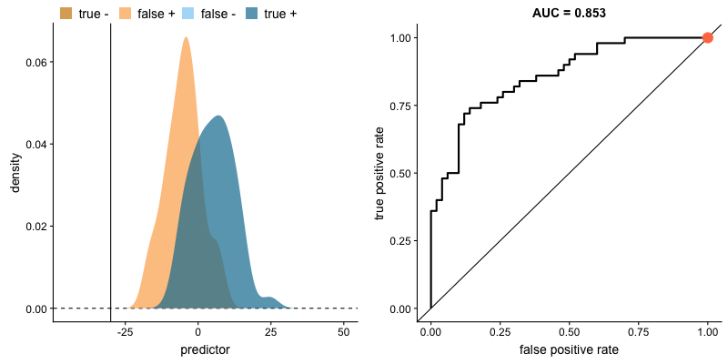

Animations with receiver operating characteristic and precision-recal curves
============================================================================

Usage
-----

Please feel free to use the animations and scripts in this repository
for teaching or learning. You can directly download the [gif
files](animations) for any of the animations, or you can recreate them
using these [scripts](R). Each script is named according to the
animation it generates (i.e. `animate_ROC.r` generates `ROC.gif` and
`animate_SD.r` generates `SD.gif`).

Receiver operating characteristic (ROC) curve
---------------------------------------------

A receiver operating characteristic curve displays how well a model can
classify binary outcomes. For example, let's assume we make a model to
distinguish between benign and malignant tumor samples. An ROC curve
demonstrates how well this model can tell whether a benign tumor is
benign and whether a malignant tumor is malignant.

An ROC curve is made by plotting a false positive rate against a true
positive rate for each possible cutoff value. In my tumor example, a
cutoff value is a value that seperates benign and malignant outcomes. If
we assume that the positive outcome is malignant, a predictor value
above the cutoff would classify a tumor as malignant, and a predictor
value below the cutoff would classify a tumor as benign. Then, the true
positive rate is the fraction of malignant tumors that were correctly
identified as malignant, and the false positive rate is the fraction of
benign tumors that were incorrectly identified as malignant.

The plot on the left shows the distributions of predictors for the two
outcomes. The vertical line that travels left-to-right is the cutoff
value. The red dot that travels along the ROC curve corresponds to the
false positive rate and the true positive rate for the cutoff value
given in the plot on the left. The changes in the cutoff value
demonstrate that when we try to increase the true positive rate, we also
increase the false positive rate. Similarly, when we try to decrease the
false positive rate, we also decrease the true positive rate. This
demonstrates that there is a trade-off between trying to classify one
outcome correctly and trying to classify the other outcome correcly.

"AUC" at the top of the right plot stands for "area under the curve",
and it tell us the area under an ROC curve. Generally, a high AUC value
is indicative of a model that can distinguish between the two outcomes
well. The AUC of 0.5 tells us that the model is a random classifier, and
it cannot distinguish between the two outcomes. In a later section you
will see the case when a model with a higher AUC value is not
necessarily better than a model with a lower AUC value.

The shape of an ROC curve changes when a model changes the way it
classifies the two outcomes.

The animation starts with a model that cannot tell one outcome from the
other, and the two distributions completely overlap (essentially a
random classifier). As the two distributions separate, the ROC curve
approaches the left-top corner, and the AUC value of the curve
increases. When the model can perfectly separate the two outcomes, the
ROC curve forms a right angle and the AUC becomes 1.

Precision-recall curve
----------------------

Precision-recall curve also displays how well a model can classify
binary outcomes. However, it does it differently from the way an ROC
curve does. Precision-recall curve plots true positive rate (recall or
sensitivity) against the positive predictive value (precision). Positive
predictive value is defined as the number of true positives divided by
the number of total positive calls, and it is meant to measure the
positive outcomes that were called correctly among all positive results.
The shape of the precision-recall curve also changes when a model
changes the way it classifies the two outcomes.

 Similarly to the ROC curve, when the two outcomes
separate, precision-recall curve will approach the top-right corner.
Typically, a model that produces a precision-recall curve that is closer
to the top-right corner is better than a model that produces a
precision-recall curve that is skewed towards the bottom of the plot.

Precision-recall curve is more sensitive to class imbalanace than an ROC curve
------------------------------------------------------------------------------

Class imbalance happens when the number of outputs in one class is
different from the number of outputs in another class. For example, one
of the distributions has 1000 observations and the other has 10. An ROC
curve tends to be more robust to class imbalanace that a
precision-recall curve. 

In this animation, both distributions start with 1000 outcomes. The blue
one is then reduced to 50. The precision-recall curve changes shape more
drastically than the ROC curve, and the AUC value mostly stays the same.
We also observe this behaviour when the other disribution is reduced to
50. 

AUC value can be misleading
---------------------------

When the standard deviation of one of the outcomes changes, an ROC curve
and its AUC value also change. In the following animation, when the
standard deviation of the blue distribution is decreased, the ROC curve
shifts upwards, and its AUC value increases. This should indicate that
the model performance has increased, when, in fact, the prediction
performance has worsened at small false positive rates.

