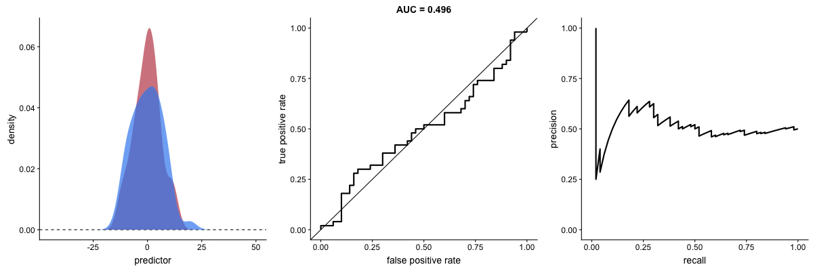
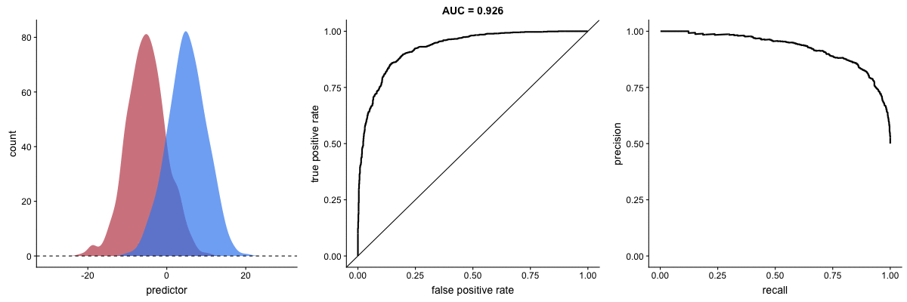
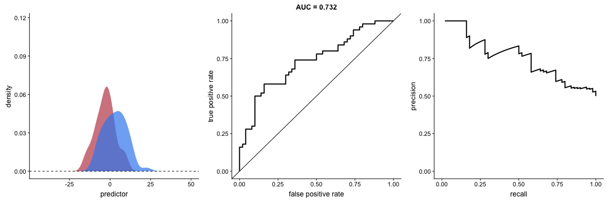

Animations with receiver operating characteristic and precision-recal curves
============================================================================

Usage
-----

Please feel free to use the animations and scripts in this repository
for teaching or learning. You can directly download the [gif
files](animations) for any of the animations, or you can recreate them
using these [scripts](R). Each script is named according to the
animation it generates (i.e. `animate_ROC.r` generates `ROC.gif` and
`animate_SD.r` generates `SD.gif`).

Receiver operating characteristic (ROC) curve
---------------------------------------------

A receiver operating characteristic curve displays how well a model can
classify binary outcomes. For example, let's assume we make a model to
distinguish between benign and malignant tumor samples. An ROC curve
demonstrates how well this model can tell whether a benign tumor is
benign and whether a malignant tumor is malignant.

An ROC curve is made by plotting a false positive rate against a true
positive rate for each possible cutoff value. In my tumor example, a
cutoff value is a value that seperates benign and malignant outcomes. If
we assume that the positive outcome is malignant, a predictor value
above the cutoff would classify a tumor as malignant, and a predictor
value below the cutoff would classify a tumor as benign. Then, the true
positive rate is the fraction of malignant tumors that were correctly
identified as malignant, and the false positive rate is the fraction of
benign tumors that were incorrectly identified as malignant.

The plot on the left shows the distributions of predictors for two
outcomes. The vertical line that travels left-to-right is the cutoff
value. The red dot that travels along the ROC curve corresponds to the
false positive rate and the true positive rate for the cutoff value
given in the plot on the left. Changing the cutoff value does not change
the shape of the ROC curve, it changes where you are on that curve.

"AUC" in the title of the right plot stands for area under the curve.
AUC tells us the area under the ROC curve, and, generally, a high AUC
value is indicative of a model that can distinguish between the two
outcomes well. Typically, AUC values of 0.7 are considered to be good.
In a later section you will see the case when a model with a higher AUC
value is not necessarily better than a model with a lower AUC value.

The shape of an ROC curve changes when a model changes the way it
classifies the two outcomes.

The animation starts with a poor model that cannot tell one outcome from
the other, and the two distributions completely overlap. As the two
distributions separate, The ROC curve approaches the left top corner,
and the AUC value of the curve increases. When a model can perfectly
separate two outcomes, an ROC curves form a right angle and AUC becomes
1.

Precision-recall curve
----------------------

Precision-recall curve also displays how well a model can classify
binary outcomes. However, it does it differently than an ROC curve.
Precision-recall curve plots true positive rate (recall or sensitivity)
against the positive predictive value (precision). Positive predictive
value is defined as the number of true positives divided by the number
of total positive calls, and it is meant to measure the positive
outcomes that were called correctly among all positive results. The
shape of the precision-recall curve also changes as the model outcome
changes. When a model can perfectly separate two outcomes, a
precision-recall curve forms a right angle like an ROC curve but in a
different direction. 

Precision-recall curve is more sensitive to class imbalanace than an ROC curve
------------------------------------------------------------------------------

Class imbalance happens when the number of outputs in one class is
different from the number of outputs in another class. For example, one
of the distributions has 1000 observations and the other has 10. An ROC
curve is more robust to class imbalanace that a precision-recall curve.

In this animation, both distributions start with 1000 outcomes. The blue
one is then reduced to 50. The precision-recall curve changes shape more
drastically than the ROC curve, and the AUC value mostly stays the same.
This pattern remains when the other class is reduced.

AUC value can be misleading
---------------------------

When the standard deviation of one of the distribution changes, AUC
value increases. This should indicate that the model performance has
increased, when, actually, the prediction performance becomes worse at
small false positive rates.

